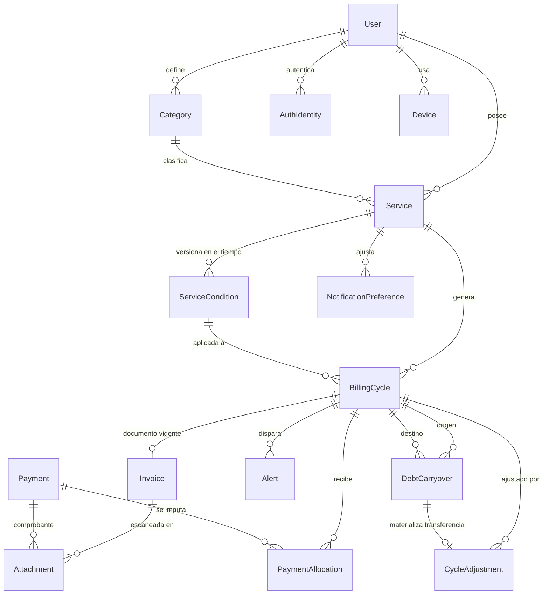

# Controlito — Análisis, arquitectura y roadmap

## Contexto

App de control de **servicios recurrentes, facturas, pagos, deudas y gastos proyectados**, pensada para el contexto argentino, donde las empresas cambian montos, vencimientos, promociones e intereses sin aviso. El problema real no es "anotar gastos": es **saber si lo que te facturaron coincide con lo que pactaste, cuánto debés realmente, y cuánta plata vas a necesitar el mes que viene**.

Directorio `C:\Users\Lucas\Desktop\Controlito` vacío — proyecto greenfield, sin git init.

**Estado de tu máquina (verificado):** Node v24.18.0 ✓ · pnpm 11.20 ✓ · git 2.53 ✓ · **Flutter/Dart NO instalados** ✗ · **Docker NO instalado** ✗ (la arquitectura elegida no lo necesita).

---

## 1. Decisiones ya tomadas (y sus consecuencias)

| Decisión | Elegido | Consecuencia en el diseño |
|---|---|---|
| Base de estimación | **Condición vigente + fallback a última factura** | El motor de estimación lee `ServiceCondition` activa en el período; si no hay, usa la última `Invoice`. Cada estimación viaja con su `source` y su fórmula en texto. |
| Comprobantes | **Locales en el dispositivo, no en la nube** | Postgres guarda **solo metadata**. Los bytes viven en el celular (carpeta privada de la app) o en el navegador (IndexedDB). Se pierden al desinstalar o limpiar datos del sitio. **No se sincronizan entre dispositivos.** |
| Offline | **Online-first + caché de lectura** | Sin base local relacional en el MVP. Riverpod con `keepAlive` + snapshot del dashboard. Escrituras requieren red. Offline real queda para V1 (Drift). |
| Plataformas | **Android + Web ahora, iOS después** | Se compila todo desde Windows. El código Flutter ya soporta iOS; solo falta una Mac (o CI macOS) + cuenta Apple Developer para firmarlo. |

### Sobre "sacar las 3 versiones hoy mismo"

No es realizable y prefiero decirlo antes de empezar que a mitad de camino. Hoy podemos tener **la Etapa 0 completa**: monorepo, backend Nest arrancando, app Flutter compilando en Android y en Chrome, base de datos conectada. El MVP funcional completo son **~5-6 semanas** de trabajo por etapas. Cada etapa deja algo demostrable en pantalla, así que vas a ver progreso desde el día 1 — pero una app financiera correcta no se hace en un día, y una que calcula mal la deuda es peor que no tenerla.

### Riesgo que asumís con los comprobantes locales (importante)

- Desinstalás la app en Android → **se pierden todas las fotos de comprobantes**.
- Limpiás datos del sitio en el navegador, usás incógnito o cambiás de navegador → **se pierden los de la web**.
- Cargás un comprobante en el celular → **no lo vas a ver en la web**, ni al revés.
- La metadata (que existía un comprobante, su nombre, tamaño, fecha) **sí** queda en la base y se sincroniza: la app te va a decir *"Comprobante `transferencia.jpg` — guardado en Pixel 7, no disponible en este dispositivo"* en vez de mentirte con un archivo roto.

El diseño deja la puerta abierta: `AttachmentStore` es una interfaz. El día que quieras respaldo en la nube, se agrega una implementación y una migración de flag, sin tocar el modelo de datos. En V1 propongo además un **exportar/importar .zip** como red de seguridad sin usar la nube.

---

## 2. Problemas y ambigüedades detectados

Estos son los puntos donde el requerimiento original tenía huecos que rompen el sistema si no se resuelven ahora:

1. **La entidad central no es la factura.** El 80% del valor ocurre *antes* de que llegue la factura (proyectar, avisar, presupuestar). Si `Invoice` fuera la raíz, cada período sin facturar sería una "factura fantasma" con `isReal=false` — un tipo de dato mentiroso que contamina todas las consultas. → **`BillingCycle` es la raíz; la factura se adjunta a un ciclo.**

2. **La máquina de estados propuesta mezcla tres ejes.** `PROYECTADO/ESPERANDO/RECIBIDA` (documental), `PAGO_PARCIAL/PAGADO` (saldo) y `VENCIDO` (fecha) son dimensiones **independientes**. Como un solo enum: un ciclo puede ser `PARCIAL` **y** `VENCIDO` a la vez y el enum solo permite uno; y `PAGADO` como columna se desincroniza del dinero real ante cualquier bug. → **Tres ejes separados** (§5.2).

3. **El doble conteo de la deuda es el riesgo #1 del producto.** Si la factura de octubre ya incluye los $10.000 de septiembre, y el dashboard suma "deuda acumulada + facturas del mes", pedís $10.000 de más. Resolverlo con un `WHERE` especial repartido en 6 consultas es garantía de que alguien lo olvide. → **Se resuelve por álgebra, no por filtros** (§6.3).

4. **"Interés desconocido" ≠ "interés cero".** El default de un servicio nuevo debe ser `UNKNOWN`, no `NONE`. Mostrar $0 de interés cuando no cargaste la regla es mentir en el número más importante. → La UI muestra `?`, nunca `$0`, cuando la regla no está definida.

5. **El eje de agregación del dashboard no estaba definido.** ¿Un gasto pertenece al mes en que se consumió, se facturó o se vence? Para "¿cuánta plata necesito?", manda **la fecha de vencimiento**. Un servicio bimestral sep-oct que vence el 20/11 es plata de noviembre.

6. **`GastosProyectados + Deuda + Intereses ≠ TotalProyectado`.** No es un error: la deuda absorbida por una factura es dinero a pagar pero **no** es gasto del mes. Confundirlos hace que el mes en que saldás una deuda vieja parezca un mes carísimo y arruina toda comparación mes a mes. → Dos métricas distintas, etiquetadas distinto.

7. **Corrimiento de fechas por UTC.** Prisma devuelve un `@db.Date` como medianoche UTC; en Argentina (UTC−3) `getDate()` sobre `2026-09-10` devuelve **9**. Y en Dart, `DateTime.parse('2026-09-10')` produce un `DateTime` local que al serializar vuelve a correrse. → Tipo `CivilDate` propio en ambas capas, string `YYYY-MM-DD` en la red, **nunca** `DateTime`/`Date` para vencimientos (§8).

8. **Flutter Web tiene tres trampas** que hay que atacar temprano, no al final: un `import 'dart:io'` rompe el build web (por eso `flutter build web` corre en cada commit desde la Etapa 0); el scroll con rueda del mouse no anda en listas anidadas sin configurarlo; y el almacenamiento seguro de tokens en web es ofuscación, no seguridad (§4.3).

---

## 3. Arquitectura general

```
┌─────────────────────────────────────────────────────────┐
│  Flutter (una sola base de código)                      │
│  Android · Web  (iOS listo, pendiente de compilar)      │
│  Riverpod · go_router · dio · Material 3 adaptativo     │
│  Comprobantes: archivos locales (móvil) / IndexedDB (web)│
└───────────────────────┬─────────────────────────────────┘
                        │ REST + JSON  (dinero como string)
┌───────────────────────▼─────────────────────────────────┐
│  NestJS + TypeScript                                     │
│  ┌────────────────────────────────────────────────┐     │
│  │ domain/   ← motor financiero PURO               │     │
│  │  sin Nest, sin Prisma, sin new Date()           │     │
│  │  proyección · saldos · intereses · períodos     │     │
│  └────────────────────────────────────────────────┘     │
│  modules/  casos de uso + controllers + repos           │
└───────────────────────┬─────────────────────────────────┘
                        │ Prisma
┌───────────────────────▼─────────────────────────────────┐
│  PostgreSQL (Neon, US East · junto al backend)            │
│  NUMERIC para dinero · DATE para vencimientos            │
│  Solo metadata de comprobantes — cero bytes              │
└─────────────────────────────────────────────────────────┘
```

### 3.1 Backend — estructura

```
apps/api/src/
├─ domain/                    ⚠️ cero imports de @nestjs/* y @prisma/*
│  ├─ money/                  Money (Decimal + moneda + redondeo)
│  ├─ time/                   CivilDate, Clock (reloj inyectado)
│  ├─ period/                 generación de períodos y vencimientos
│  ├─ interest/               modelos de mora
│  ├─ balance/                saldo del ciclo
│  ├─ projection/             ★ motor de proyección
│  └─ notification-plan/      plan de avisos con dedupeKey
├─ common/                    problem+json, zod pipe, paginación, idempotencia
├─ infra/                     prisma, config, clock, logging
└─ modules/
   auth · users · categories · services · conditions ·
   cycles · invoices · payments · adjustments · carryovers ·
   attachments(metadata) · dashboard · projections · notifications
```

**El motor financiero es una función pura.** Todo entra por parámetro: no hay repos, no hay `await`, no hay `Date.now()`. Se testea con tablas de casos, corre en menos de 1 ms, y —clave— es portable a Dart casi 1:1 si algún día querés proyectar sin conexión. La regla se hace cumplir automáticamente con ESLint + `dependency-cruiser` en CI: si alguien importa `PrismaService` dentro de `domain/`, el build falla.

**Decisiones concretas:**
- **Validación: zod + `nestjs-zod`.** Un solo schema sirve para request, response, OpenAPI y —vía generador— los modelos Dart. Con `class-validator` la salida queda sin contrato y se filtran campos por accidente.
- **Errores: RFC 9457 (`application/problem+json`)** con un campo `code` estable (`INVOICE_ALREADY_PAID`) y `traceId`. El cliente hace `switch` sobre `code`, nunca sobre el mensaje. Mensajes en español desde el servidor.
- **Paginación keyset (cursor)**, no offset: las listas de facturas crecen y `OFFSET` produce saltos y duplicados.
- **Idempotencia**: header `Idempotency-Key` en todo POST que mueve plata. Reintentar en una red mala no puede duplicar un pago.
- **Jobs**: la mora se calcula **on-read** en el motor puro, nunca por un cron que escribe. Así el dashboard es correcto aunque el cron no haya corrido (relevante en Render free, donde el servicio duerme).

### 3.2 Multi-tenant: la garantía va en la base, no en un interceptor

Evalué las tres opciones y descarto el interceptor genérico de ownership (se desincroniza, agrega una query por request, y no cubre listados ni writes anidados) y la inyección silenciosa de `userId` vía Prisma extension (no cubre operaciones anidadas ni `$queryRaw`, y convierte un bug en "no hay datos" en lugar de un error visible).

**Elegido: defensa en 4 capas, con la garantía dura en Postgres.**

1. **Estructural** — `userId` denormalizado en toda tabla, y la FK al padre es **compuesta**:
   ```prisma
   model Invoice {
     userId    String
     serviceId String
     service   Service @relation(fields: [serviceId, userId], references: [id, userId])
     @@unique([id, userId])
     @@index([userId, dueDate, status])
   }
   ```
   Con esto **Postgres rechaza** un `Payment` del usuario B apuntando a una `Invoice` del usuario A. Deja de ser una convención y pasa a ser un invariante de la base, imposible de romper por un bug de aplicación. Bonus: todas las consultas quedan `WHERE userId = $1 AND ...` con índices que arrancan por `userId`.
2. **Tipos** — los repos reciben `TenantContext` (branded type) como primer argumento. Solo lo produce el `AuthGuard` a partir del JWT verificado; no compila sin él.
3. **Centinela** — Prisma extension que **lanza** `TenantScopeViolation` en dev/test si una query a un modelo tenant no lleva `userId`. Falla ruidoso, no inyecta callado.
4. **Tests** — `tenant-isolation.e2e-spec.ts` recorre **todas** las rutas con `:id` (descubiertas del router en runtime) y verifica que el usuario B recibe **404** (no 403, que filtra existencia). Una ruta nueva sin cobertura hace fallar el test.

### 3.3 Autenticación

- **argon2id** para passwords (`@node-rs/argon2`).
- **Access JWT 15 min**, siempre **solo en memoria**, nunca en disco en ninguna plataforma.
- **Refresh 30 días, opaco, rotativo, con detección de reuso**: se guarda `sha256(token)` + `familyId`; si llega un refresh ya consumido, se revoca toda la familia. Es la mitigación estándar contra robo de token y es barata desde el día 1.
- **Tabla `AuthIdentity(userId, provider, providerUserId)` desde el MVP**, con `provider='password'` como una identidad más. Agregar Google/Apple después es un módulo nuevo y una fila — **cero migraciones de `User`**. El error clásico es meter `googleId` en `User` y tener que refactorizar todo.
- **Almacenamiento del refresh**: `flutter_secure_storage` en Android (Keystore, sólido). En **web** hay un problema real: `flutter_secure_storage` en web es ofuscación sobre `localStorage`, y la solución correcta (cookie `httpOnly`) exige que API y web compartan dominio registrable, si no Safari y Firefox la bloquean.
  → **MVP: refresh en `localStorage` con TTL corto + rotación agresiva, riesgo documentado.** Cuando compres un dominio (~US$10/año, `api.controlito.app` + `app.controlito.app`), se pasa a cookie `httpOnly` same-site cambiando solo la implementación de `TokenStore`. Lo dejo listo desde el inicio; no es bloqueante.
- **Mutex de refresh en el cliente**: un único refresh en vuelo con `Completer` compartido. Sin esto, 5 pantallas cargando en paralelo disparan 5 refresh, la detección de reuso ve reuso y **desloguea al usuario**. Es un bug clásico y confuso.

### 3.4 Frontend Flutter

```
apps/app/lib/
├─ core/  theme · l10n(es-AR) · router · network(dio+interceptors) ·
│         money · time · storage · widgets(MoneyText, AdaptiveScaffold)
└─ features/  auth · dashboard · services · conditions · cycles ·
              invoices · payments · attachments · projections ·
              alerts · notifications · settings
```

- **Riverpod** (`flutter_riverpod` 3 + generador + `riverpod_lint` como error). La app es 80% lectura asíncrona con caché: `AsyncNotifierProvider` + `AsyncValue` resuelve loading/data/error sin escribir estados a mano, y `family` + `autoDispose` dan caché por entidad gratis. Registrar un pago debe refrescar factura, lista, dashboard y proyección: en Riverpod es `ref.invalidate(...)` declarativo; con Bloc son eventos cruzados entre blocs, que es donde esos proyectos se enredan.
- **go_router** con `StatefulShellRoute.indexedStack` (preserva el estado de cada tab; obligatorio para que el botón "atrás" del navegador funcione). **Los filtros van en query params**, no en estado interno: en web la URL se comparte y se bookmarkea.
- **Layout adaptativo por ancho, nunca por plataforma** (un Android en tablet debe ver el layout ancho):

  | Ancho | Navegación | Contenido |
  |---|---|---|
  | < 600 | `NavigationBar` abajo: Dashboard · Servicios · Alertas · Perfil | 1 panel + FAB |
  | 600–839 | `NavigationRail` con íconos | 1 panel |
  | 840–1199 | `NavigationRail` extendido | lista + detalle |
  | ≥ 1200 | `NavigationDrawer` permanente: + Calendario, Configuración | lista + detalle, `maxWidth: 1280` |

- **Dinero**: paquete `decimal`, **nunca `double`** (en web Dart compila `int` a double de 64 bits: el bug de precisión es *peor* en web que en móvil). Formato `NumberFormat.currency(locale: 'es_AR')` → `$ 35.500,00`. `MoneyText` con `FontFeature.tabularFigures()` para que las columnas de montos aliñeen.
- **Input de montos**: `TextInputType.numberWithOptions(decimal: true)` y aceptar **coma y punto** normalizando — varios teclados Android no muestran coma.

### 3.5 Comprobantes: almacenamiento local

```
┌──────────── Flutter ────────────┐        ┌──── Backend ────┐
│ AttachmentStore (interfaz)      │        │ Attachment      │
│  ├ MobileFileStore              │  meta  │  (solo metadata)│
│  │   getApplicationDocuments…   │───────▶│  deviceId       │
│  │   /attachments/{uuid}.jpg    │        │  fileName       │
│  └ WebIndexedDbStore            │        │  mimeType       │
│      IndexedDB: bytes + key     │        │  sizeBytes      │
└─────────────────────────────────┘        │  sha256         │
   los BYTES nunca salen del dispositivo   │  localRef       │
                                           └─────────────────┘
```

- **Móvil**: `getApplicationDocumentsDirectory()`, **nunca** el directorio de caché (el SO lo purga sin aviso).
- **Web**: IndexedDB. Se guarda `{key, bytes, mime, name}`.
- **Compresión antes de guardar**: máx 1600px lado mayor, JPEG q80 (~200–400 KB). Una foto de 12 MP son 5 MB y en web pueden tirar la pestaña por memoria. `flutter_image_compress` **no soporta web** → implementación condicional con el paquete `image` (Dart puro) en web.
- **Captura**: `image_picker` (cámara/galería, móvil) y `file_picker` (PDF y web). Ambos devuelven **bytes** en web, no `File`: la abstracción interna es siempre `PickedFile(bytes, name, mime)` y **nunca se importa `dart:io`** en código compartido.
- **Coherencia entre dispositivos**: el backend sabe que el comprobante existe y dónde está. En otro dispositivo la UI muestra el ítem en gris con la leyenda de origen y un botón "adjuntar en este dispositivo".
- El `sha256` permite detectar que el mismo archivo se re-adjuntó desde otro equipo y unificar la referencia.

### 3.6 Notificaciones

**Principio: el backend planifica, el dispositivo materializa.** Si la lógica de "cuándo avisar" vive en Dart, hay que reimplementarla para push, cada cambio de regla exige un release en la store, y diverge entre plataformas.

```
GET /v1/notifications/plan?horizonDays=60
→ items: [{ dedupeKey: "cycle:0192…:due:-3", scheduledAt, channel: "LOCAL",
            title: "Movistar vence en 3 días", body: "10/09 · $ 35.500,00",
            deepLink: "controlito://cycles/0192…" }]
```

- `dedupeKey` determinístico: el mismo evento genera la misma clave hoy en local y mañana en push.
- **`channel` lo decide el servidor**. El día que exista push, el servidor marca `PUSH` y el cliente deja de programar local automáticamente. **Cero ventana de duplicados**, sin que el cliente tenga que razonar.
- El cliente cancela **todas** las locales y reprograma el plan completo (idempotente, sin estados zombis).
- **Android**: `AndroidScheduleMode.inexactAllowWhileIdle`. Pedir alarmas exactas (`SCHEDULE_EXACT_ALARM`) arriesga el rechazo en Google Play por un beneficio nulo — un recordatorio de vencimiento puede diferirse minutos.
- **iOS** (cuando llegue): máximo **64 notificaciones locales pendientes**; si se excede, iOS descarta las demás **en silencio**. → ventana rodante: el cliente toma las primeras 60 del plan ordenado.
- **Web: no hay notificaciones locales en el MVP.** `flutter_local_notifications` no soporta web y la API del navegador solo funciona con la pestaña abierta sin Service Worker + Push. En su lugar: panel "Próximos vencimientos" prominente + badge en la navegación. Es honesto y suficiente para escritorio.
- Tabla `Device` creada desde el MVP con `pushToken` nullable → cuando se agregue FCM no hay migración.
- **Limitación aceptada del MVP**: una factura cargada en la web no genera notificación en el celular hasta que abras la app en el celular. Se comunica explícitamente en la pantalla de notificaciones.

### 3.7 Infraestructura

| Pieza | Elegido | Por qué |
|---|---|---|
| Base de datos | **Neon**, región **US East (Ohio)** | Free tier sin expiración — el PostgreSQL free de Render se borra a los **30 días** (+14 de gracia), verificado en su changelog. Va **co-ubicada con el backend**, no cerca del usuario: un request del celular cruza la distancia una vez, pero el backend le hace varias consultas seguidas a la base, y esa latencia se multiplica. Además da **branching copy-on-write en ~1s** → testing sin Docker (que no tenés instalado). |
| API | Render (región **Ohio**, la misma que la base) — **free para staging, Starter (US$7) para producción** | En free el servicio duerme a los 15 min y despertar tarda **30-60s**. No hay atajo. Mitigación en el cliente igualmente: timeout de 60s y UI de "Despertando el servidor…" en vez de un spinner mudo. |
| Web | Cloudflare Pages | Estático, CDN, previews por PR, gratis. Requiere `_redirects` con `/* /index.html 200` o un F5 en `/services/123` da 404. |
| Monorepo | pnpm workspaces, **sin Turborepo** | API y app están totalmente acopladas por el contrato: un cambio de campo debe ser **un PR atómico**. Turborepo es overhead con 2 apps. |

**Detalle Prisma + Neon obligatorio**: dos URLs. `DATABASE_URL` con `?pgbouncer=true&connection_limit=1` (sin esto aparece el error `prepared statement "s0" already exists`, uno de los más confusos de Prisma) y `DIRECT_URL` sin pooler para las migraciones.

**Generación del contrato Dart**: el backend emite `openapi.json` desde los schemas zod → generador → modelos `freezed`. CI falla si hay diff sin commitear. Hace **imposible** que cliente y servidor se desalineen sin que alguien lo vea.

---

## 4. Modelo de datos

### 4.1 Diagrama



### 4.2 Entidades y campos clave

**`User`** — `id`, `email` (citext único), `passwordHash`, `timezone` (`America/Argentina/Buenos_Aires`), `locale` (`es-AR`), `defaultCurrency` (`ARS`), timestamps.

**`Service`** — `userId`, `categoryId?`, `name` ("Internet Fibra 600MB"), `providerName` ("Movistar"), `accountNumber?`, `status` (ACTIVE/PAUSED/CANCELLED), `startDate` (DATE), `endDate?`, `currency`, `debtPolicy`, `debtParams` (Json), `autoDebit`, `notes`, `archivedAt?`.

**`ServiceCondition`** — la versión temporal de las condiciones. **Inmutable**: cambiar = cerrar la vigente e insertar una nueva.
`serviceId`, `validFrom` (DATE, inclusivo), `validTo?` (DATE, **exclusivo**; null = vigente), `amountMode` (FIXED / VARIABLE_ESTIMATED / VARIABLE_UNKNOWN), `baseAmount`, `frequency` (WEEKLY…ANNUAL/CUSTOM_DAYS), `periodAnchorDate`, `dueDayOfMonth`, `dueDayPolicy` (CLAMP_TO_LAST_DAY por defecto), `secondDueDayOfMonth?` + `secondDueSurcharge?` (segundo vencimiento con recargo, típico argentino), `interestModel`, `interestParams` (Json), `changeReason`.

> Constraint que Prisma no expresa y va en SQL manual — **las condiciones de un servicio no pueden solaparse**:
> ```sql
> ALTER TABLE service_conditions ADD CONSTRAINT sc_no_overlap
>   EXCLUDE USING gist ("serviceId" WITH =,
>     daterange("validFrom", COALESCE("validTo",'infinity'::date), '[)') WITH &&);
> ```

**`BillingCycle`** — **la entidad central**. `userId`, `serviceId`, `conditionId?`, `periodStart`/`periodEnd` (DATE, fin exclusivo), `periodKey` ("2026-10"), `periodIndex`, `dueDate` (DATE), `dueDateSource`, `projectedDueDate` (para medir el desvío), `expectedAmount` (**estimado**), `expectedAmountSource`, `expectedAmountLocked`, `lifecycle`, `settlement` (caché derivada), y el caché de saldos (`totalAmountCache`, `adjustmentsCache`, `paidAmountCache`, `balanceCache`).
`@@unique([serviceId, periodStart])` ← **la idempotencia del proyector vive acá.**

**`Invoice`** — el documento real. `cycleId`, `externalNumber?`, `issueDate`, `dueDate` (real, pisa la del ciclo), y la **descomposición del total**:
```
totalAmount = currentChargeAmount        (consumo/abono del período)
            + includedPriorDebtAmount    (saldo anterior que la factura ya trae)
            + priorDebtInterestAmount    (punitorios facturados)
            + otherChargesAmount
```
Con `CHECK` en la base que lo verifica. Esta descomposición es lo que hace posible no contar dos veces (§6.3). Más `isEstimatedByProvider` (la "factura estimada" de la distribuidora: obligación real, consumo estimado), `status` (ISSUED/VOID), `replacesId?` para rectificativas.
Índice único parcial: `CREATE UNIQUE INDEX ON invoices("cycleId") WHERE status='ISSUED'` — un ciclo tiene a lo sumo una factura vigente.

**`Payment`** — **inmutable**. `serviceId`, `paymentDate` (DATE), `amount` (siempre positivo), `method`, `reference?`, `status` (APPLIED/REVERSED/REVERSAL), `reversalOfId?`, `idempotencyKey?`. Nunca se edita ni se borra: se revierte con un asiento contrario.

**`PaymentAllocation`** — imputación de un pago a un ciclo. Un pago puede cubrir varios ciclos y un ciclo recibir varios pagos. El remanente no imputado es **pago a cuenta** (crédito).

**`CycleAdjustment`** — todo lo que mueve el saldo sin ser factura ni pago: `CREDIT_NOTE`, `REFUND`, `DISCOUNT`, `SURCHARGE`, `MANUAL_INTEREST`, `WRITE_OFF`, y **`CARRYOVER_TRANSFER_OUT`** (la pieza anti-doble-conteo). `amount` **firmado**.

**`DebtCarryover`** — vínculo explícito entre el ciclo impago y el ciclo que debería absorberlo. `fromCycleId`, `toCycleId?`, `status` (OPEN/ABSORBED_BY_INVOICE/SETTLED_BY_PAYMENT/WRITTEN_OFF), `principalAmount`, `estimatedInterestAmount`, `interestModelUsed`, `interestDaysUsed`, y al reconciliar: `actualPrincipalAmount`, `actualInterestAmount`, `reconciliationDelta`.

**`Attachment`** — **solo metadata**. `ownerType` (INVOICE/PAYMENT), `invoiceId?`/`paymentId?`, `fileName`, `mimeType`, `sizeBytes`, `sha256`, `storageMode: LOCAL_DEVICE`, `deviceId`, `deviceLabel`, `localRef`, `capturedAt`.

**`Alert`** — la detección de cambios. `type` (AMOUNT_INCREASE, DUE_DATE_CHANGED, MISSING_INVOICE, DEBT_DETECTED, PROMO_ENDING, PROJECTION_DRIFT…), `severity`, `status`, `baselineValue`, `observedValue`, `deltaAbsolute`, `deltaPercent`, `dedupeKey` (único por usuario), `resolvedByConditionId?` (el usuario acepta el cambio → se crea una condición nueva).

**Soporte**: `Category`, `AuthIdentity`, `RefreshToken`, `Device`, `NotificationPreference`, `JobRun`.

**Fuera del MVP** (el modelo los admite después sin romper nada): `InvoiceLine`, `Holiday`, `ExchangeRate`, `InflationAssumption`, `Debt`/`DebtInstallment` (préstamos en cuotas), `ProviderCatalog`.

### 4.3 Convenciones transversales

- **IDs UUIDv7** — ordenables temporalmente, sin la fragmentación de índice de v4, sin exponer conteos como los serial.
- **`userId` denormalizado + FK compuesta** en toda tabla tenant (§3.2).
- **Soft delete solo en configuración** (`Service`, `Category` vía `archivedAt`). En entidades financieras, **jamás**.
- Índices que arrancan por `userId`: `(userId, dueDate, lifecycle)` para el dashboard, `(serviceId, periodIndex)` para el historial, y parciales sobre `balanceCache > 0`.
- **Vista `v_cycle_balance`** como fuente de verdad del saldo; las columnas `*Cache` se recalculan en la misma transacción de cada escritura, y un job nocturno compara caché vs vista. Cualquier divergencia es un bug P0.

---

## 5. Reglas financieras

### 5.1 Principios

1. **Hecho real ≠ estimación.** Nunca en la misma columna. Todo monto estimado lleva su `source` y se renderiza con marcador visual (≈, itálica, tooltip con la fórmula).
2. **Los eventos financieros son inmutables.** No hay `UPDATE` de monto en `Invoice`/`Payment`. Se anula (`VOID`) o se revierte con un asiento contrario.
3. **El saldo se deriva, no se escribe a mano.**
4. **La deuda se transfiere, no se duplica.**
5. **`expectedAmount` se congela cuando llega el dato real** — pero se conserva, para medir el error de proyección.

### 5.2 Estados: tres ejes, no uno

**Eje 1 — `lifecycle` (persistido):** dónde está el período en el proceso documental.

| Estado | Significado |
|---|---|
| `PROJECTED` | Período futuro o en curso. Monto estimado. |
| `AWAITING_INVOICE` | El período cerró; la factura debería haber llegado. **Acá se congela la estimación y se arma el arrastre de deuda.** |
| `INVOICED` | Hay factura `ISSUED` vinculada. |
| `CLOSED` | Saldo 0 (o transferido) y sin acciones pendientes. |
| `SKIPPED` | El usuario declaró "no me facturaron este período". |
| `CANCELLED` | El servicio se dio de baja antes del período. |

**Eje 2 — `settlement` (derivado del saldo, cacheado):** `UNPAID` · `PARTIAL` · `PAID` · `OVERPAID` · `ZERO`.

**Eje 3 — flags calculados en la consulta, nunca persistidos:**
```
isOverdue        = balance > 0 ∧ dueDate < hoy(tz del usuario) ∧ lifecycle ∈ {AWAITING_INVOICE, INVOICED}
isDueSoon        = balance > 0 ∧ 0 ≤ dueDate − hoy ≤ prefs.diasAntes
isMissingInvoice = lifecycle = AWAITING_INVOICE ∧ hoy > periodEnd + gracia
```

> ¿Por qué `AWAITING_INVOICE` sí se persiste si también es derivable de la fecha? Porque tiene **efectos secundarios**: al entrar, congela el `expectedAmount` y crea el `DebtCarryover`. `OVERDUE` no tiene efectos secundarios — por eso no se persiste, y así ningún cron que falle puede hacer que el dashboard mienta.

Mapeo a los **estados visuales** que pediste (siempre con ícono + texto, nunca solo color): 🟢 al día · 🟡 pago parcial · 🔴 vencido · 🟠 factura pendiente de verificar · 🔵 próxima estimada · ⚠️ diferencia detectada.

### 5.3 Generación de ciclos: híbrido con horizonte

Ni materializar todo por cron (crece sin techo y hace peligrosos los cambios retroactivos de condición) ni virtual puro (imposible adjuntar una factura anticipada o una nota del usuario en un mes futuro).

**Elegido: materializar hasta `hoy + 3 períodos`; más allá, proyectar en memoria.**

```
projectCycles(serviceId, horizonte = hoy + 3 períodos):
  para cada período P hasta el horizonte:
    condición = la vigente en P.periodStart
    upsert BillingCycle por (serviceId, periodStart):
      CREATE → lifecycle = PROJECTED
      UPDATE → SOLO si lifecycle ∈ {PROJECTED, AWAITING_INVOICE} y no expectedAmountLocked
      NUNCA toca INVOICED / CLOSED / SKIPPED / CANCELLED   ← barrera de inmutabilidad
```

- **Idempotente por construcción**: `periodStart` es determinístico desde `periodAnchorDate`, jamás desde "hoy". Correr el job 1 o 50 veces da lo mismo.
- **Doble disparador**: cron nocturno + invocación sincrónica al crear/editar servicio o condición y al abrir el dashboard si quedó desactualizado. El cron es una optimización, **no una dependencia** — así funciona igual en Render free, donde el servicio duerme.
- `pg_advisory_xact_lock` por usuario para que dos instancias no proyecten en paralelo.
- **Cambio retroactivo de condición**: se recalculan solo los ciclos aún `PROJECTED`/`AWAITING_INVOICE`. Los ya facturados **no se tocan**; si el cambio los afectaba, se emite una alerta informativa.

### 5.4 Saldo

```
totalEfectivo(c) = invoice.totalAmount        si hay factura ISSUED
                 = expectedAmount             si no
                 = 0                          si SKIPPED o CANCELLED

ajustes(c)       = Σ CycleAdjustment.amount   (firmados)
pagado(c)        = Σ allocations de pagos APPLIED − Σ de pagos REVERSAL

saldo(c)         = totalEfectivo + ajustes − pagado
```
`saldo < 0` = crédito a favor. `settlement` es una función pura de estas cantidades.

**Imputación por defecto (FIFO)**: un pago sin imputación explícita se aplica a los ciclos del servicio con saldo > 0 ordenados por `dueDate` ascendente. Es lo que hacen las empresas argentinas y coincide con tu interés (cortar el devengamiento de punitorios). El usuario **no tiene que elegir** si un pago es total o parcial: se deriva.

### 5.5 Estimación de la próxima factura (tu decisión)

```
1. ¿Hay ServiceCondition vigente en el período con amountMode = FIXED?
      → expectedAmount = baseAmount              source = USER_FIXED
2. ¿Hay condición vigente con amountMode = VARIABLE_ESTIMATED y baseAmount?
      → expectedAmount = baseAmount              source = USER_ESTIMATE
3. ¿No hay condición pero hay facturas anteriores?
      → expectedAmount = última Invoice.currentChargeAmount   source = LAST_INVOICE
4. amountMode = VARIABLE_UNKNOWN o sin datos
      → expectedAmount = null                    source = UNKNOWN   → la UI muestra "?"
```

El `expectedAmount` **nunca incluye deuda ni intereses** — esos son componentes separados. Y todo estimado viaja con su fórmula en texto:
```
"Condición vigente desde 01/03/2027 (fin de promoción): $35.000"
```

### 5.6 Deuda e intereses: enum + params, sin motor de reglas

En Argentina el espacio real son ~4 políticas de deuda y ~5 modelos de interés. Un motor de reglas genérico agregaría un intérprete, un validador y un depurador propios para cubrir un caso hipotético. Enum discriminante + `Json` de parámetros + Strategy cubre el 100% de lo conocido, y `CUSTOM`/`UNKNOWN` es la válvula de escape. Agregar un modelo nuevo = una clase + un valor de enum (~40 líneas).

| `DebtPolicy` | Comportamiento |
|---|---|
| `ACCUMULATES_INTO_NEXT_INVOICE` | Crea el arrastre apuntando al ciclo siguiente; suma deuda + interés estimado al próximo ciclo, **en columnas separadas** del consumo. |
| `PAID_SEPARATELY` | Arrastre con `toCycleId = null`: es deuda, pero no infla la factura futura. |
| `NO_DEBT_SERVICE_CUT` | Sin arrastre; alerta crítica "riesgo de corte". |
| `UNKNOWN` | Arrastre del principal (es deuda cierta), interés **"?"**, sin destino asumido. |

| `InterestModel` | Fórmula (`P` = principal, `d` = días de mora efectivos) |
|---|---|
| `NONE` | `I = 0` |
| `MONTHLY_PERCENT` | simple `P × tasa × d/30` · compuesto `P × ((1+tasa)^(d/30) − 1)` |
| `DAILY_PERCENT` | `P × tasa × d` |
| `FIXED_FEE` | `fee`, o `fee × ceil(d/periodo)` |
| `UNKNOWN` | `null` → la UI muestra **"?"**, nunca $0 |

**El default de un servicio nuevo es `UNKNOWN`, no `NONE`.** Redondeo **al final**, una sola vez por arrastre, `HALF_UP` a 2 decimales — nunca redondear intermedios. `d` se guarda en `interestDaysUsed` para que el número sea reproducible y auditable.

---

## 6. Fórmulas del dashboard

### 6.1 Eje de agregación: `dueDate`

No `periodStart` ni `issueDate`. La pregunta que responde el dashboard es *"¿cuánta plata necesito este mes?"*, y eso lo determina **cuándo hay que pagar**. Un servicio bimestral cuyo período abarca sep-oct pero vence el 20/11 es plata de noviembre. (El eje por período se ofrece como vista secundaria "gasto devengado", útil para analizar consumo, no para presupuestar.)

### 6.2 Conjuntos (partición disjunta por construcción)

```
A(M)  = ciclos con dueDate ∈ [inicio de M, fin de M] y lifecycle ∈ {PROJECTED, AWAITING_INVOICE, INVOICED}
        ├ A_real = los INVOICED    → montos REALES
        └ A_est  = el resto         → montos ESTIMADOS
D(M)  = ciclos con dueDate < inicio de M ∧ saldo > 0     → deuda viva de meses anteriores
P(M)  = pagos con paymentDate ∈ M                        → eje de caja, otra dimensión
```

`A`, `D` y el futuro particionan el universo por `dueDate` en tres intervalos excluyentes — un ciclo tiene exactamente un `dueDate`. Y `P(M)` **no se resta** de `A` ni `D`: lo pagado ya está descontado dentro de `saldo(c)`.

### 6.3 El mecanismo anti-doble-conteo

Cuando llega una factura con `includedPriorDebtAmount > 0`, en una sola transacción:

```
1. Se encuentra el DebtCarryover OPEN del servicio.
2. Se registran los valores reales y el delta contra lo estimado.
3. Se crea en el CICLO ORIGEN:
      CycleAdjustment { type: CARRYOVER_TRANSFER_OUT, amount: −saldo(cicloOrigen) }
   ← lo lleva EXACTAMENTE a 0
4. El arrastre pasa a ABSORBED_BY_INVOICE, con el link a la factura.
5. El ciclo origen queda saldo = 0 → settlement PAID → lifecycle CLOSED.
```

**Ninguna consulta del dashboard necesita saber de arrastres para evitar el doble conteo**: el ciclo origen tiene saldo 0 *por álgebra*, y por lo tanto no cumple el filtro `saldo > 0` de `D(M)`. Un `WHERE status != 'ABSORBED'` repartido en seis consultas es exactamente el tipo de regla que un día alguien olvida; el ajuste algebraico no se puede olvidar.

**Si la factura declara un saldo anterior distinto al tuyo** ($34.500 vs tus $35.000): se transfiere **tu saldo real**, se guarda el delta, y se emite una alerta: *"La factura incluye $34.500 de saldo anterior, pero tu registro dice $35.000. ¿Cargaste un pago de menos?"* El total del dashboard siempre respeta la factura real; el delta es información, no dinero.

### 6.4 Las seis métricas

| # | Métrica | Fórmula | Qué responde |
|---|---|---|---|
| **M1** | Gastos proyectados del mes | `Σ_{c∈A(M)} [ consumoDelPeríodo(c) + otrosCargos(c) + ajustesNoDeuda(c) ]` | "¿Cuánto me cuestan mis servicios este mes?" **Excluye deuda vieja e intereses facturados**, si no el mes en que saldás una deuda parece un mes carísimo de consumo. Se expone partido en `real` / `estimado` / `desconocido`. |
| **M2** | Total pagado | `Σ_{p∈P(M)} ±p.amount` (− si es reversión) | Base caja: cuánta plata salió este mes. Métrica paralela, **no** un término de las otras. |
| **M3** | Pendiente real | `Σ_{c∈A_real(M)} max(saldo,0)` | Solo facturas emitidas: lo que sabés con certeza que tenés que pagar. El número de mayor confianza. |
| **M4** | Deuda acumulada | `Σ_{c∈D(M)} saldo(c)` | Saldos vencidos que **siguen vivos** (no absorbidos, no pagados). Se desagrega por antigüedad: 1-30 / 31-60 / 61-90 / 90+. |
| **M5** | Intereses estimados | `Σ_{c∈D(M), modelo∉{NONE,UNKNOWN}} interés(saldo, dueDate+gracia → fecha objetivo)` | Solo sobre `D(M)`. Los intereses **ya facturados** están dentro del total del ciclo y se contarían dos veces si se re-estimaran — la condición `c∈D(M)` los excluye sola. Se acompaña de "+ intereses de N servicios (monto desconocido)". |
| **M6** | **Total proyectado** | `M3 + PendienteEstimado + M4 + M5 − créditosDisponibles` | "¿Cuánta plata necesito para cubrir todo?" Incluye los débitos automáticos (es plata que tenés que tener en la cuenta). |

> **Identidad clave, que debe estar testeada en CI:** `M6 ≠ M1 + M4 + M5` en general. Solo coinciden cuando ninguna deuda fue absorbida y nada está pago. Esta asimetría es la trampa principal del dominio.

### 6.5 Ejemplo numérico con tus números

**Situación al 05/10/2026.** Movistar: condición vigente $25.000/mes, vence el 10, `debtPolicy = ACCUMULATES`, interés 5% mensual.

| Ciclo | Vence | lifecycle | total | pagado | ajustes | **saldo** |
|---|---|---|---|---|---|---|
| Movistar 2026-09 | 10/09 | INVOICED (real $25.000) | 25.000,00 | 15.000,00 | 0 | **10.000,00** |
| Movistar 2026-10 | 10/10 | AWAITING_INVOICE (est. $25.000) | 25.000,00 | 0 | 0 | 25.000,00 |

Arrastre: `principal 10.000,00`, interés estimado `10.000 × 5% × 30/30 = 500,00`.

**Dashboard antes de que llegue la factura:**

| Métrica | Cálculo | Valor |
|---|---|---|
| M1 Gastos proyectados | `25.000` (est.) | 25.000,00 |
| M3 Pendiente real | ninguna factura de octubre aún | 0,00 |
| — Pendiente estimado | `25.000` | 25.000,00 |
| M4 Deuda acumulada | saldo de septiembre | **10.000,00** |
| M5 Intereses estimados | `10.000 × 5%` | **500,00** ≈ |
| **M6 Total proyectado** | `0 + 25.000 + 10.000 + 500` | **35.500,00** |

Y la proyección se muestra desglosada, exactamente como pediste:
```
  $25.000,00   servicio (condición vigente desde 01/09/2026)
+ $10.000,00   deuda de septiembre (impaga)
+    $500,00 ≈ interés estimado (5% mensual · 30 días)
─────────────
  $35.500,00   estimado
```

**Llega la factura real de octubre por $35.500** (`consumo 25.000` + `saldo anterior 10.000` + `punitorios 500`):

1. Ciclo de octubre → `INVOICED`; `expectedAmount` se conserva en 25.000 (desvío 0%).
2. Arrastre → `ABSORBED_BY_INVOICE`, delta 0.
3. Ajuste `CARRYOVER_TRANSFER_OUT −10.000` en el ciclo de septiembre.
4. Septiembre: `25.000 − 10.000 − 15.000 = 0` → `PAID` → `CLOSED`.

| Métrica | Antes | Después |
|---|---|---|
| M1 Gastos proyectados | 25.000,00 | 25.000,00 |
| M3 Pendiente real | 0,00 | **35.500,00** |
| M4 Deuda acumulada | 10.000,00 | **0,00** |
| M5 Intereses estimados | 500,00 | **0,00** |
| **M6 Total proyectado** | **35.500,00** | **35.500,00** ✓ |

Los $10.000 y los $500 **cambiaron de contenedor** sin alterar el total ni un centavo. Ese es el invariante que garantiza el diseño, y es un test obligatorio de la suite.

Si después pagás $20.000 el 12/10: M2 = 20.000 · M3 = 15.500 · M6 = 15.500 · el ciclo queda `PARTIAL` · y el 11/10 pasa a `isOverdue` si sigue con saldo. M1 **no cambia** (pagar no reduce el gasto).

---

## 7. Casos borde a cubrir

| Caso | Tratamiento |
|---|---|
| **Factura que llega tarde** | El ciclo sigue en el dashboard con el estimado + alerta `MISSING_INVOICE`. Si el `dueDate` real cae en otro mes, el ciclo **migra de mes**: correcto, el eje es cuándo hay que pagar. Se guarda `projectedDueDate` para medir el desvío. |
| **Factura que nunca llega** | El usuario marca `SKIPPED`. **No se borra el ciclo**: si aparece en 3 meses, `SKIPPED → INVOICED` recupera el historial. Los arrastres que apuntaban a él se liberan. |
| **Factura por menos de lo esperado** | Alerta `AMOUNT_DECREASE`. Si es un cambio permanente, aceptar la alerta **crea una `ServiceCondition` nueva** — así el historial de condiciones se mantiene sin edición manual. |
| **Sobrepago** | `saldo < 0` → `OVERPAID`. La UI **ofrece** mover el excedente al ciclo siguiente; no lo hace sola. El crédito resta de M6, nunca de M1. |
| **Pago sin factura (a cuenta)** | El remanente no imputado queda como crédito del servicio. Al llegar la factura real, se re-imputa solo. |
| **Nota de crédito vs reintegro** | Regla clara: **si volvió plata a tu cuenta → `Payment` de reversión; si solo bajó lo que debés → `CycleAdjustment`.** Nunca se edita el total de la factura. |
| **La factura trae deuda y el usuario no la marcó** | Si `total > estimado × (1+umbral)` **y** existe un arrastre abierto → alerta crítica *"Esta factura parece incluir los $10.000 que debías. ¿Confirmás?"*. Hasta confirmar **no se absorbe**: el dashboard sobreestima, que es el error seguro (pedir de más, no de menos). |
| **Cambio de condición a mitad de ciclo** | El ciclo usa la condición vigente en `periodStart` para identidad y vencimiento. Para el monto: si es fijo, se prorratea por días; si es variable, se usa la nueva. Solo afecta ciclos no facturados. |
| **Servicios bimestrales / anuales** | El ciclo entra **completo** en el mes de su vencimiento. Para la vista de gasto devengado se prorratea por días, **nunca** para M6 — la caja no se prorratea. |
| **Vencimiento día 31 en meses cortos** | `CLAMP_TO_LAST_DAY` por defecto (31/02 → 28 o 29). Tests para los 12 meses × año bisiesto. |
| **Vencimiento en fin de semana/feriado** | Ajuste opcional por servicio, **desactivado por defecto**: la mayoría de los servicios argentinos aceptan el día hábil siguiente sin recargo, y mover el número de mes confunde más de lo que ayuda. |
| **Segundo vencimiento con recargo** | El ciclo se proyecta con el primero. Entre el 1° y el 2°, la UI muestra "pagando ahora: $X + recargo Y%". No se persiste como saldo hasta que se pague o se facture. |
| **Servicio dado de baja con deuda** | La baja **no borra deuda**. Los ciclos con saldo siguen contando en M4. Sección "servicios de baja con deuda". |
| **Anular una factura que tiene pagos** | `status = VOID` + motivo. Las imputaciones **no se borran** (apuntan al ciclo, no a la factura). Si hay rectificativa, se vincula; si no, el ciclo vuelve a `AWAITING_INVOICE`. |
| **Revertir un pago** (transferencia devuelta) | Asiento contrario, nunca borrado. El ciclo puede reabrirse de `CLOSED` a `INVOICED` y volverse vencido. |
| **Pago duplicado** | `Idempotency-Key` previene el duplicado técnico (doble tap); una alerta detecta el duplicado humano (mismo servicio, mismo monto, ±2 días). |
| **Factura estimada de la distribuidora** (gas) | Obligación **real** con consumo estimado. Cuenta en M3 normal, marcada en la UI. La refacturación posterior se trata como rectificativa. |
| **Débito automático** | El pago se registra igual. **M6 lo incluye**: es plata que tenés que tener en la cuenta. Se etiqueta para que sepas que no tenés que hacer nada. |
| **Moneda distinta** (Netflix en USD) | Se almacena en la moneda del servicio, siempre. El dashboard suma **por moneda** y el total convertido se marca como estimado con la cotización visible. Nunca se persiste un monto convertido como si fuera un hecho. (V1) |

---

## 8. Dinero y fechas

### Dinero

| Capa | Tipo |
|---|---|
| PostgreSQL | `NUMERIC(20,4)` — exacto, sin punto flotante; 16 dígitos enteros sobreviven a cualquier escenario inflacionario |
| Prisma / NestJS | `Decimal` (decimal.js, el mismo que Prisma ya expone) — **nunca `number`** |
| Transporte JSON | **`string`**: `{"amount": "35500.00", "currency": "ARS"}` |
| Flutter / Dart | paquete `decimal` — **nunca `double`** |

- **4 decimales de almacenamiento, 2 de presentación.** Los cálculos intermedios (interés diario, prorrateo) generan fracciones de centavo; truncar a 2 en cada paso acumula error. Se redondea a 2 **una sola vez**, al final, con `HALF_UP` (la convención comercial argentina; el redondeo bancario haría que el dashboard difiera del papel).
- **Gotcha que aparece el día 2**: `Prisma.Decimal` **no es JSON-serializable** — sin un serializer global, Nest devuelve `{}` y se pierde una tarde. Se previene con schemas zod de respuesta + interceptor global.
- La escala de redondeo se deriva de la moneda, no se hardcodea (ARS→2, CLP→0).
- Los tests de redondeo del cliente usan **los mismos casos** que los del backend: cualquier divergencia en un total es un reporte de bug garantizado.

### Fechas

**Regla: fecha de negocio → `DATE`. Instante de sistema → `TIMESTAMPTZ`.**

- `DATE`: `dueDate`, `periodStart/End`, `issueDate`, `paymentDate`, `validFrom/To`. Un vencimiento el 10/09 es el 10/09 en Ushuaia y en Madrid.
- `TIMESTAMPTZ(3)`: `createdAt`, `updatedAt`, `voidedAt`, `detectedAt`, expiraciones de token.
- **En la red**: fechas puras como `"2026-09-10"` (sin hora ni Z); instantes como `"2026-10-08T17:32:07.123Z"`. Dos formatos, dos significados, nunca intercambiables.
- **En Dart no se usa `DateTime` para vencimientos**: `DateTime.parse('2026-09-10')` da un valor local que al serializar se corre de día. Se define `CivilDate(year, month, day)`.
- **Regla de lint**: `getDate/getMonth/toLocaleDateString` prohibidos sobre valores que vengan de columnas `DATE`.
- **`User.timezone`** se usa en exactamente tres lugares: calcular "hoy" para vencido/próximo y los límites del mes; programar notificaciones; mostrar timestamps de auditoría. **Nunca `CURRENT_DATE` en SQL** — el servidor está en UTC y después de las 21:00 ART ya sería "mañana". El cliente **no** decide "hoy" para cálculos financieros: consume las fechas y flags del backend, así el dashboard es consistente aunque viajes.

---

## 9. Pantallas

### Móvil (bottom nav, 4 destinos) · Web (rail/drawer, + Calendario y Configuración)

| Pantalla | Contenido |
|---|---|
| **Dashboard** | Tarjetas: Total proyectado (M6, protagonista) · Gastos del mes (M1, real vs estimado) · Pagado (M2) · Pendiente (M3) · Deuda acumulada (M4) · Intereses estimados (M5, con "?" si hay desconocidos). Debajo: próximos vencimientos ordenados por fecha, y la lista de servicios con su estado. **Una sola llamada HTTP** pinta todo (6 requests paralelos en 3G son 3 segundos de spinner). |
| **Servicio (detalle)** | Resumen actual · Situación financiera (facturado y pagado histórico, deuda, próximo estimado) · **Próximo ciclo con el desglose línea por línea** · Facturas · Pagos · Comprobantes · Condiciones (vigente + historial) · Alertas del servicio. |
| **Alta/edición de servicio** | Datos + primera condición en el mismo flujo. Editar una condición **abre un diálogo que explica** que se cierra la vigente y se crea una nueva versión, con selector de "vigente desde". |
| **Cargar factura** | Servicio → ciclo (sugerido) → monto → vencimiento → nº → adjunto. **Comparación inmediata contra lo esperado**: diferencia absoluta, porcentual y cambio de vencimiento. |
| **Registrar pago** | Monto (con "pagar todo el saldo" como atajo) → fecha → método → comprobante (cámara/galería/PDF). El saldo y el estado se recalculan y se muestran al confirmar. Nunca se pregunta "¿es total o parcial?". |
| **Proyecciones** | Barras apiladas por componente (servicio / deuda / interés) por mes, y al tocar un mes, el detalle por servicio con la fórmula de cada número. |
| **Alertas** | Cambios detectados, agrupados por severidad. Cada una con acción: "aceptar el cambio" (→ crea condición nueva), "confirmar que incluye la deuda", "ignorar". |
| **Calendario** (web) | Vista mensual de vencimientos. |
| **Configuración** | Perfil, zona horaria, notificaciones globales y por servicio, gestión de comprobantes locales (espacio usado, exportar). |

Regla de UI transversal: **todo número estimado se distingue visualmente del real** (≈ + tooltip con la fórmula). En una app financiera con inflación alta, confundir estimado con real es el peor fallo de producto posible.

---

## 10. Roadmap

Cada etapa: se explica qué y por qué → se genera el código → se explica cómo probarlo → se verifica que compile → recién ahí sigue la próxima.

### MVP

| # | Etapa | Entregable | Listo cuando |
|---|---|---|---|
| **0** | Fundaciones | Instalar Flutter SDK · monorepo pnpm · Nest + Prisma + zod + pino · Flutter con go_router y tema M3 · Neon conectado · CI en GitHub Actions | `pnpm dev` levanta la API con `/health` OK; `flutter run -d chrome --web-port=5555` y `-d android` muestran una pantalla; CI verde |
| **1** | Auth y aislamiento | Registro/login/refresh/logout · argon2id · rotación con detección de reuso · `AuthIdentity` · guard + `TenantContext` + centinela Prisma · login en Flutter con mutex de refresh | La suite `tenant-isolation` pasa; login funciona en Android y Chrome; 5 requests en paralelo con token vencido disparan **un solo** refresh; F5 en web mantiene la sesión |
| **2** | Servicios y condiciones | CRUD de `Service`, `Category` y `ServiceCondition` versionada con el constraint de no-solapamiento · FKs compuestas · UI con formato es-AR | Se crea "Movistar / Internet Fibra 600MB" con condición $25.000 desde 01/09/2026; se agrega una segunda versión desde 01/03/2027 y el historial muestra ambas sin solaparse |
| **3** | Ciclos y proyector | `BillingCycle` + proyector idempotente + `computeDueDate` con todas las políticas de día | Correr el proyector 50 veces no duplica un ciclo; día 31 en febrero cae donde debe (test de 12 meses × bisiesto); los ciclos aparecen en la app como "próximos vencimientos" |
| **4** | Facturas y detección | `Invoice` con descomposición + `CHECK` · máquina de estados · comparación esperado vs real · alertas de monto y vencimiento | Cargar $32.500 contra un esperado de $25.000 muestra "+$7.500 (30%)" y genera la alerta; el ciclo pasa a `INVOICED` y el vencimiento real pisa al proyectado |
| **5** | Pagos y saldos | `Payment` inmutable + `PaymentAllocation` + FIFO + `CycleAdjustment` + reversión + idempotencia | Tres pagos parciales de $10.000/$5.000/$10.000 cierran una factura de $25.000; el estado pasa `UNPAID → PARTIAL → PAID` solo; reenviar el mismo `Idempotency-Key` no duplica |
| **6** | Deuda, intereses y proyección | `DebtCarryover` + **absorción con `CARRYOVER_TRANSFER_OUT`** + estrategias de interés + motor de proyección con fórmula explicada | **El ejemplo de §6.5 pasa como test**: M6 vale 35.500 antes y después de la absorción; un servicio con `interestModel = UNKNOWN` muestra "?" y nunca $0 |
| **7** | Dashboard | `GET /dashboard` con las 6 métricas + ETag · pantalla completa · estados visuales con ícono + texto | Una sola request pinta todo; `If-None-Match` devuelve 304; se ve bien en 360px y 1440px; el estado vacío tiene un CTA claro |
| **8** | Comprobantes locales | `AttachmentStore` + `MobileFileStore` + `WebIndexedDbStore` · compresión condicional · metadata en la API · UI de "no disponible en este dispositivo" | Se saca una foto en Android y se ve al abrir el pago; se sube un PDF en Chrome y se ve en Chrome; en el otro dispositivo aparece el ítem en gris con su origen; ningún `import 'dart:io'` en código compartido (`flutter build web` verde) |
| **9** | Notificaciones locales | `plan-builder` puro + `GET /notifications/plan` + preferencias globales y por servicio + `flutter_local_notifications` + `timezone` + deep links | Con el reloj adelantado llega el aviso en Android; tocarlo navega al ciclo; en web no se programa nada y se ve el panel de próximos vencimientos; cambiar preferencias reprograma sin duplicar |
| **10** | Endurecer y publicar | Rate limiting · Sentry · `minSupportedVersion` · builds release · web en Cloudflare Pages con splash y `_redirects` · API en Render Starter · **probar un restore de backup, no solo confiar en que existe** · AAB firmado | La app instalada desde el AAB hace el flujo completo contra producción; la web carga en <5s en 4G simulado |

**→ MVP: ~5-6 semanas de trabajo por etapas.**

### V1

1. **Exportar/importar comprobantes en .zip** — tu red de seguridad ante el borrado, sin usar la nube.
2. **Google + Apple Sign-In** — sin migrar `User`, gracias a `AuthIdentity`. (Apple es **obligatorio** en App Store si hay Google.)
3. **iOS** — compilar y firmar con Mac o CI macOS + cuenta Apple Developer.
4. **Push (FCM)** — el `channel` cambia server-side y el cliente deja de programar local, sin ventana de duplicados.
5. **Offline real (Drift + outbox)** — escribir sin conexión y sincronizar; seguro gracias a la idempotencia ya construida. En web, IndexedDB sin activar COEP (activarlo rompería la carga de CanvasKit).
6. **Deudas en cuotas** (`Debt` + amortización francesa) y **multi-moneda** con cotizaciones.
7. **Informes** CSV/PDF mensuales (CSV con separador `;` y decimal `,`, si no Excel en es-AR lo rompe).

### Futuro (evaluar con uso real, no antes)
OCR de facturas (siempre editable antes de guardar, nunca auto-guardado) · presupuestos por categoría · escenarios de proyección comparables · catálogo de proveedores argentinos precargado · **hogar compartido** (⚠️ requiere pasar el tenant de `userId` a `householdId`: si te interesa, hay que decidirlo en V1, después es una migración grande).

---

## 11. Verificación

**Por etapa** (ninguna avanza sin esto):
- `pnpm lint` — incluye `dependency-cruiser`: falla si `domain/` importa Nest o Prisma.
- `pnpm typecheck` y `prisma migrate diff` — falla si el schema cambió sin migración.
- `pnpm test:unit` — motor financiero, **umbral 95%**, con tablas de casos.
- `pnpm test:e2e` — contra una branch efímera de Neon (sin Docker).
- `flutter analyze --fatal-infos`, `flutter test`.
- **`flutter build web`** en cada commit — atrapa el error más caro del proyecto (un `dart:io` que rompe web, descubierto tarde).
- Prueba manual guiada: te digo exactamente qué tocar en la app y qué tenés que ver.

**Tests de invariante obligatorios** (lo que separa esta app de una que calcula mal):
1. La suma de saldos antes y después de una absorción de deuda **no cambia**.
2. M6 es idéntico antes y después de que llegue la factura que incluye la deuda (§6.5).
3. `totalAmount = suma de sus componentes` para toda factura.
4. `balanceCache == v_cycle_balance.balance` sobre un dataset generado.
5. `computeDueDate` para días 29/30/31 × 12 meses × año bisiesto.
6. Aislamiento entre usuarios en **todas** las rutas con `:id`.

---

## 12. Decisiones abiertas (no bloquean el arranque)

Las resolvemos cuando lleguemos a la etapa que las necesita:

- **Dominio propio** (~US$10/año) — habilita cookies `httpOnly` seguras en web. Decidir antes de la Etapa 10. Mientras tanto, `localStorage` con rotación agresiva.
- **Latencia desde Argentina** — Render no tiene región en Sudamérica (Oregon, Ohio, Virginia, Frankfurt, Singapur): desde Buenos Aires son ~150-200ms contra Ohio. Se mitiga con el diseño (el dashboard es **una sola llamada**, no seis). Si un día molesta, Fly.io tiene región `gru` en São Paulo (~30ms) y el backend es portable. Revisar en la Etapa 10.
- **Hogar compartido** — si es probable a mediano plazo, conviene decidirlo antes de V1.
- **Catálogo de proveedores argentinos precargado** (Movistar, Edenor, Metrogas, AySA…) — mejora mucho el alta de servicios; se puede sembrar en cualquier momento.
